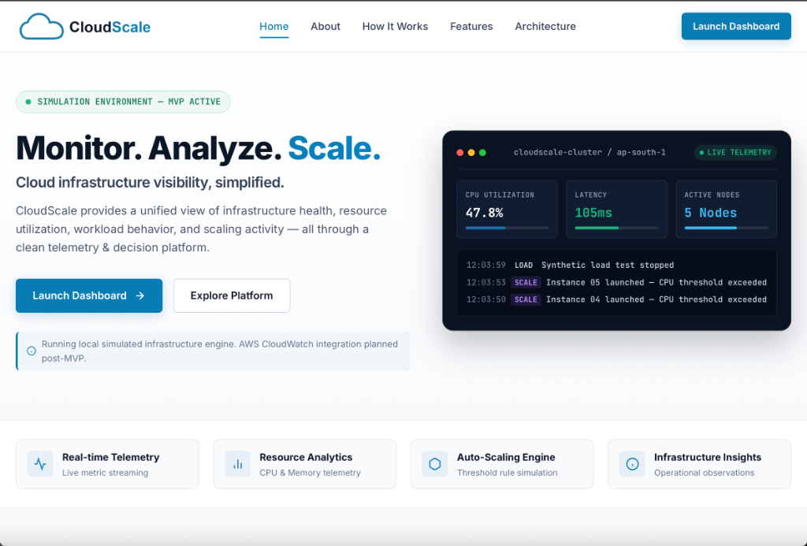

# CloudScale

> **Monitor. Analyze. Scale.**



CloudScale is a cloud infrastructure monitoring and auto-scaling **simulation platform** built as a Cloud Computing internship project. It provides real-time visualization of resource utilization telemetry, workload behavior, system activity logs, and automated scaling decisions through a unified web interface and Python FastAPI backend.

---

## Overview

Modern cloud platforms auto-scale compute capacity based on live metric telemetry. CloudScale simulates this operational cycle in a safe, reproducible environment. Rather than connecting to live cloud accounts or reading local host machine hardware, CloudScale employs an **in-memory simulated telemetry engine** that dynamically models CPU utilization, memory usage, request traffic, latency, instance scaling events, and operational insights.

This project demonstrates core cloud computing principles—including decoupled microservice design, RESTful API design, dynamic auto-scaling algorithms, synthetic load testing, and telemetry visualization.

> [!NOTE]
> **Academic MVP Notice**: CloudScale intentionally uses simulated infrastructure data. It does **not** collect personal computer hardware metrics, personal files, network statistics, AWS credentials, or company data.

---

## Features

### 📊 Infrastructure Monitoring
- Real-time streaming metrics for **CPU Utilization (%)**, **Memory Usage (%)**, **Request Rate (req/s)**, and **Latency (ms)**.
- Historical trend visualization using interactive dual-axis line charts.
- Configurable auto-polling interval (3 seconds) maintaining a rolling 30-point metric history buffer.

### ⚡ Synthetic Load Testing
- Integrated load generator to simulate traffic spikes on demand.
- Observe immediate CPU utilization spikes (76%–94%) and elevated request rates (1,400–2,600 req/s).
- Evaluates auto-scaler threshold responsiveness under stress conditions.

### ⚙️ Auto-Scaling Simulation
- Threshold-based rule engine that dynamically scales active compute instances.
- Configurable policy controls: **Enable/Disable Auto-Scaling**, **Min Instances**, **Max Instances**, **Scale-Up Threshold (%)**, and **Scale-Down Threshold (%)**.
- Real-time logging of scale-up and scale-down actions into the system activity feed.

### 🖥️ Infrastructure Resources
- Dynamic resource table reflecting active instance count (`cloudscale-01`, `cloudscale-02`, etc.).
- Individual instance health indicators, region metadata (`ap-south-1`), instance types (`t3.small`), and per-node CPU/memory allocation.

### 📜 Activity/Event Feed
- Chronological audit log recording system initialization, policy updates, synthetic load test toggles, and instance scaling decisions.

### 💡 Infrastructure Insights
- Rule-based telemetry analysis engine evaluating current cluster health.
- Generates operational observations (e.g., warning notifications when CPU exceeds 75% advising capacity expansion).

### 🖥️ Web Interface & Dashboard
- **Landing Page**: Public portal featuring interactive hero telemetry widgets, architecture flow diagrams, feature highlights, and embedded live dashboard preview.
- **Dashboard SPA**: Full operational console featuring multi-tab views (Overview, Resources, Monitoring, Auto Scaling, Analytics, Activity, Settings) and Dark/Light appearance themes.

### 🔌 REST API
- Fully typed, asynchronous FastAPI backend exposing structured JSON endpoints for metric streaming, policy management, and load generation.

---

## How It Works

CloudScale operates through a continuous feedback loop between the client interface, API layer, simulation engine, and auto-scaler:

```
+-------------------------------------------------------------+
|                      Landing Page                           |
|      (Product Overview, Architecture & Preview Iframe)       |
+------------------------------+------------------------------+
                               |
                               v
+-------------------------------------------------------------+
|                      Full Dashboard                         |
|   (Interactive Console, Metrics Charts & Policy Control)    |
+------------------------------+------------------------------+
                               |  HTTP / JSON Polling (3s)
                               v
+-------------------------------------------------------------+
|                     FastAPI Backend                         |
|           (REST API Endpoints & CORS Middleware)            |
+------------------------------+------------------------------+
                               |
                               v
+-------------------------------------------------------------+
|                 Simulated Telemetry Engine                  |
|  (Dynamic calculation of CPU, RAM, Requests & Latency)      |
+------------------------------+------------------------------+
                               |
                               v
+-------------------------------------------------------------+
|                    Auto-Scaling Logic                       |
|   (Evaluates CPU vs. Thresholds -> Scale Up / Scale Down)   |
+------------------------------+------------------------------+
                               |
                               v
+-------------------------------------------------------------+
|                      Dashboard Updates                      |
|       (UI reflects new Instance Count, Resources & Logs)    |
+-------------------------------------------------------------+
```

---

## Architecture

The project follows a decoupled client-server architecture:

```
┌────────────────────────────────────────────────────────────────────────┐
│                              FRONTEND                                  │
│                                                                        │
│   Landing Page (index.html)        Dashboard SPA (dashboard/index.html)│
│   ├── Hero Live Widget             ├── Metrics & Trend Charts          │
│   ├── Interactive Preview Iframe   ├── Active Resource Table           │
│   └── Mobile Drawer & Navigation   └── Policy Configuration Form       │
│               │                                │                       │
└───────────────┼────────────────────────────────┼───────────────────────┘
                │  Fetch Requests (/api/*)       │
                └────────────────┬───────────────┘
                                 │
┌────────────────────────────────v───────────────────────────────────────┐
│                              BACKEND                                   │
│                                                                        │
│   Python FastAPI Application (main.py / api/index.py)                  │
│   ├── CORSMiddleware (Cross-Origin Resource Sharing)                   │
│   ├── Static File Servers (/css, /js, /assets, /dashboard)             │
│   ├── In-Memory State Store (metrics, history, activity events)        │
│   ├── Telemetry Generator (tick loop using exponential smoothing)      │
│   └── Auto-Scaling Evaluator (threshold verification)                  │
└────────────────────────────────────────────────────────────────────────┘
```

---

## Technology Stack

| Layer | Technology | Purpose |
|---|---|---|
| **Frontend Core** | HTML5, CSS3, JavaScript (ES6+) | Structure, custom glassmorphism styling, and asynchronous client logic |
| **Frontend Libraries** | [Chart.js](https://www.chart.js.org/) (v4.4.4) | Interactive real-time metrics & analytics chart rendering |
| **Typography** | Google Fonts (Inter, JetBrains Mono) | Modern web typography |
| **Backend Framework** | [FastAPI](https://fastapi.tiangolo.com/) (v0.115.12) | Asynchronous REST API framework |
| **Data Validation** | [Pydantic](https://docs.pydantic.dev/) (v2.10.6) | Data parsing and endpoint request validation |
| **ASGI Server** | [Uvicorn](https://www.uvicorn.org/) (v0.35.0) | High-performance ASGI web server |
| **Language** | Python 3.10+ | Telemetry simulation logic and backend server |

---

## API Endpoints

The backend provides the following REST API endpoints:

| Method | Endpoint | Purpose | Response Format |
|---|---|---|---|
| `GET` | `/` | Serves the main landing page (`index.html`) | `text/html` |
| `GET` | `/api/health` | Health check endpoint returning service status | `application/json` |
| `GET` | `/api/metrics` | Triggers a simulation tick and returns current metrics & history | `application/json` |
| `GET` | `/api/resources` | Returns list of active compute resources matching instance count | `application/json` |
| `GET` | `/api/autoscaling` | Fetches current auto-scaling configuration policy | `application/json` |
| `POST` | `/api/autoscaling` | Updates auto-scaling policy parameters (`min`, `max`, thresholds) | `application/json` |
| `POST` | `/api/load-test` | Starts or stops the synthetic load test generator | `application/json` |
| `GET` | `/api/activity` | Retrieves the list of recent infrastructure events and scaling logs | `application/json` |
| `GET` | `/api/insights` | Returns rule-based operational observations based on CPU utilization | `application/json` |

---

## Simulated Telemetry

CloudScale uses an **in-memory simulation core** (`tick()` function in `main.py`) to generate realistic operational metrics:

- **Target Target CPU & Requests**:
  - **Normal Workload**: CPU target selected randomly between `35%` and `65%`; requests between `350` and `950` req/s.
  - **Load-Test Workload**: CPU target selected between `76%` and `94%`; requests between `1,400` and `2,600` req/s.
- **Smoothing & Dynamics**:
  - CPU approaches target via exponential smoothing formula: `state["cpu"] += (target - state["cpu"]) * 0.28`.
  - Latency scales dynamically with CPU load: `max(35, int(45 + state["cpu"] * 1.15 + noise))`.
  - Memory usage gradually shifts within an operational band.

### Why Simulated Telemetry?
1. **Academic Demonstration**: Safe for academic evaluation without incurring cloud infrastructure costs.
2. **Reproducibility**: Guarantees consistent, repeatable scaling demonstrations.
3. **Privacy**: Protects personal computer and enterprise privacy by not scanning host hardware or networks.
4. **Instant Traffic Control**: Allows instant toggling of high-workload scenarios without complex benchmarking setups.

---

## Auto-Scaling Logic

The simulation engine evaluates scaling policy conditions during each metric update (`tick()`):

```python
# Default Configuration Parameters
min_instances = 1
max_instances = 5
scale_up_threshold = 75.0   # Scale UP when CPU >= 75%
scale_down_threshold = 30.0 # Scale DOWN when CPU <= 30%
```

### Operational Rules
1. **Scale-Up Condition**:
   - If `CPU >= 75%` and `current_instances < max_instances`:
   - Increment `instances` by `1`.
   - Log event: `Instance XX launched — CPU threshold exceeded`.
2. **Scale-Down Condition**:
   - If `CPU <= 30%` and `current_instances > min_instances`:
   - Decrement `instances` by `1`.
   - Log event: `Instance removed — workload returned to normal`.
3. **Bounds Enforcement**:
   - Instance count will **never exceed `5`** (or configured `max_instances`).
   - Instance count will **never fall below `1`** (or configured `min_instances`).

---

## Project Structure

```
.
├── README.md                  # Project documentation
├── requirements.txt           # Python backend dependencies
├── vercel.json                # Vercel deployment & routing configuration
├── main.py                    # FastAPI application & telemetry simulation engine
├── api/
│   └── index.py               # Vercel serverless function entry point
├── index.html                 # Main landing page HTML
├── css/
│   └── styles.css             # Landing page CSS design system
├── js/
│   └── main.js                # Landing page interactivity & live hero widget script
├── dashboard/
│   ├── index.html             # Full Dashboard SPA (HTML + inline JS controller)
│   ├── logo-light.png         # Brand logo (light mode)
│   ├── logo-dark.png          # Brand logo (dark mode)
│   ├── icon-light.png         # Brand icon (light mode)
│   ├── icon-dark.png          # Brand icon (dark mode)
│   ├── favicon.png            # Dashboard favicon
│   ├── favicon.ico            # Shortcut icon
│   └── favicon.svg            # Vector icon
└── assets/
    ├── favicon.png            # Root favicon
    ├── favicon.svg            # Vector favicon
    └── images/                # Landing page image assets & icons
        ├── cloudscale-preview.png
        ├── logo-light.png
        ├── logo-dark.png
        ├── icon-light.png
        ├── icon-dark.png
        ├── favicon.png
        └── favicon.ico
```

---

## Running Locally

### Prerequisites
- Python 3.10 or higher installed.
- Modern web browser (Chrome, Firefox, Safari, Edge).

### Installation & Setup

1. **Clone the repository**:
   ```bash
   git clone https://github.com/DPrajwal07/Cloud-Scale.git
   cd Cloud-Scale
   ```

2. **Install Python dependencies**:
   ```bash
   pip install -r requirements.txt
   ```

3. **Start the FastAPI server**:
   ```bash
   python -m uvicorn main:app --host 127.0.0.1 --port 8000 --reload
   ```

4. **Access the application**:
   - **Landing Page**: Open [http://127.0.0.1:8000](http://127.0.0.1:8000)
   - **Dashboard SPA**: Open [http://127.0.0.1:8000/dashboard/index.html](http://127.0.0.1:8000/dashboard/index.html)
   - **API Documentation**: Open [http://127.0.0.1:8000/docs](http://127.0.0.1:8000/docs)

---

## Testing the Demo

Follow this step-by-step workflow to test the monitoring and auto-scaling simulation:

1. **Open the Dashboard**: Navigate to `http://127.0.0.1:8000/dashboard/index.html`.
2. **Observe Baseline Metrics**: Verify CPU utilization (~40%–50%), Memory (~45%), Requests (~600 req/s), and active instance count (2 instances).
3. **Start Synthetic Load Test**: Click the **"Generate Load"** button at the bottom of the overview tab.
4. **Observe Workload Increase**: Watch the request rate increase to >1,500 req/s and CPU utilization rise past 75%.
5. **Observe Auto-Scaling Behavior**: As CPU crosses the 75% scale-up threshold, watch the instance count scale up automatically from 2 to 3, 4, and 5 instances.
6. **Check Activity Log**: Scroll to the "Recent activity" card or click the **Activity** tab to view recorded scaling events (`Instance 03 launched — CPU threshold exceeded`).
7. **Stop the Load Test**: Click the **"Stop Load Test"** button.
8. **Observe Workload Normalization**: Watch CPU utilization and request rates return toward baseline levels.
9. **Inspect Auto-Scaling Configuration**: Navigate to the **Auto Scaling** tab to adjust thresholds or instance boundaries as desired.

---

## Deployment

This project is prepared for cloud deployment on **Vercel**:

- **Serverless Entry Point**: [`api/index.py`](file:///Users/prajwald/Documents/Landing%20Page%20/api/index.py) exposes the FastAPI instance to Vercel's Python runtime.
- **Routing**: [`vercel.json`](file:///Users/prajwald/Documents/Landing%20Page%20/vercel.json) maps `/api/*` requests to the serverless function while serving static assets (`index.html`, `dashboard/index.html`, `css`, `js`, `assets`) directly.

🔗 **Live Application Link**: [Live Demo](ADD_VERCEL_URL_AFTER_DEPLOYMENT) *(Update placeholder after Vercel deployment)*

---

## Privacy and Data Security

- 🔒 **Zero Host Access**: CloudScale does **not** read Mac/PC hardware sensors, RAM statistics, CPU temperatures, or local system processes.
- 🔒 **Zero Personal Data**: Does **not** read, log, or transmit personal files, browser histories, or user identity information.
- 🔒 **Zero Credentials**: Does **not** store or require AWS access keys, secret tokens, or cloud provider credentials.

---

## Limitations

- **Simulated Infrastructure Engine**: Telemetry data is generated synthetically in memory rather than queried from actual cloud environments.
- **In-Memory State**: Metric history, scaling settings, and event logs are stored in backend memory; restarting the server resets the simulation state to defaults.
- **Single-Node Logic**: Simulates cluster instance counts logically without launching real virtual machine instances or Docker containers.

---

## Future Scope

Planned post-MVP enhancements include:

- ☁️ **AWS CloudWatch Integration**: Connect to real CloudWatch APIs via Boto3 to stream actual EC2 instance metrics.
- 🏗️ **AWS Auto Scaling Groups**: Trigger real AWS EC2 Auto Scaling group actions via AWS SDK.
- 🗄️ **Persistent Metric Storage**: Replace in-memory history with PostgreSQL or TimescaleDB for historical data retention.
- 🔐 **User Authentication**: Add user authentication and workspace multi-tenancy.
- 🤖 **Machine Learning Telemetry Prediction**: Implement predictive auto-scaling using time-series forecasting algorithms.

---

## Academic Project

CloudScale was developed as a **Cloud Computing Internship Project** by **Prajwal**.

### Key Learning Objectives Demonstrated
- **Microservices & Client-Server Architecture**: Decoupling presentation layers from simulation logic.
- **RESTful API Engineering**: Constructing typed JSON endpoints with FastAPI and Pydantic.
- **Cloud Elasticity Principles**: Modeling horizontal scaling (scale-up / scale-down) based on resource thresholds.
- **Telemetry & Observability**: Real-time metric streaming, historical data buffers, and activity event logging.

---

## Author

**Prajwal**  


---

## License

This project is developed exclusively for educational and academic purposes.
